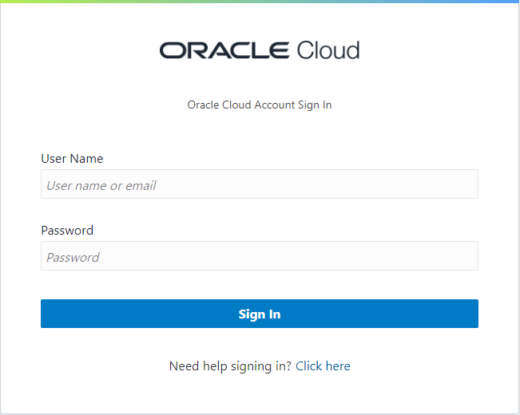

# Acessando a Oracle Cloud

1. Acesso o link: https://www.oracle.com/cloud/sign-in.html

Digite o nome da sua Conta/Tenancy no campo Cloud Account Name.

2. Iserir suas credenciais de usuário ou logar por SSO.

